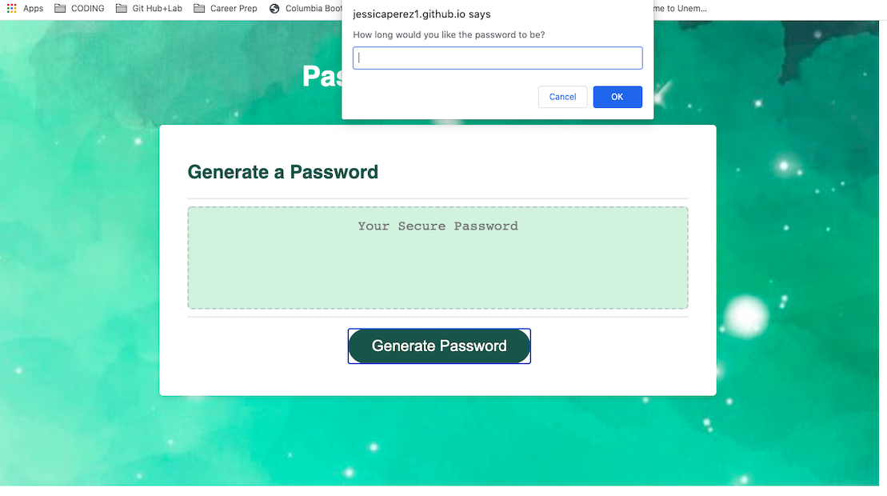

## Purpose of this project

Create an application that generates a random password based on user input that will meet certain creteria.

If you are unfamiliar with special characters, take a look at [some examples](https://www.owasp.org/index.php/Password_special_characters).

## What I did

```
I included pseudocode in the JS file to facilitate understanding
Generate button is active and working
Web app is responsive
User creteria HAS to meet web app creterias
Web app creteria are the following:
- password has to be between 8 and 128 characters long
- password HAS to include at least 1 number, 1 lower case letter, 1 cap letter, and 1 symbol.
Once user's input meets ALL creteria, it will generate a strong and secure password
The new password will appear in place of "Your secure password" on our web page
```

## Web app screenshot



## File submission

HTML, JS and CSS files submitted for review:

- The URL of the deployed application:
  

- The URL of the GitHub repository:


© 2019 Trilogy Education Services, a 2U, Inc. brand. All Rights Reserved.
